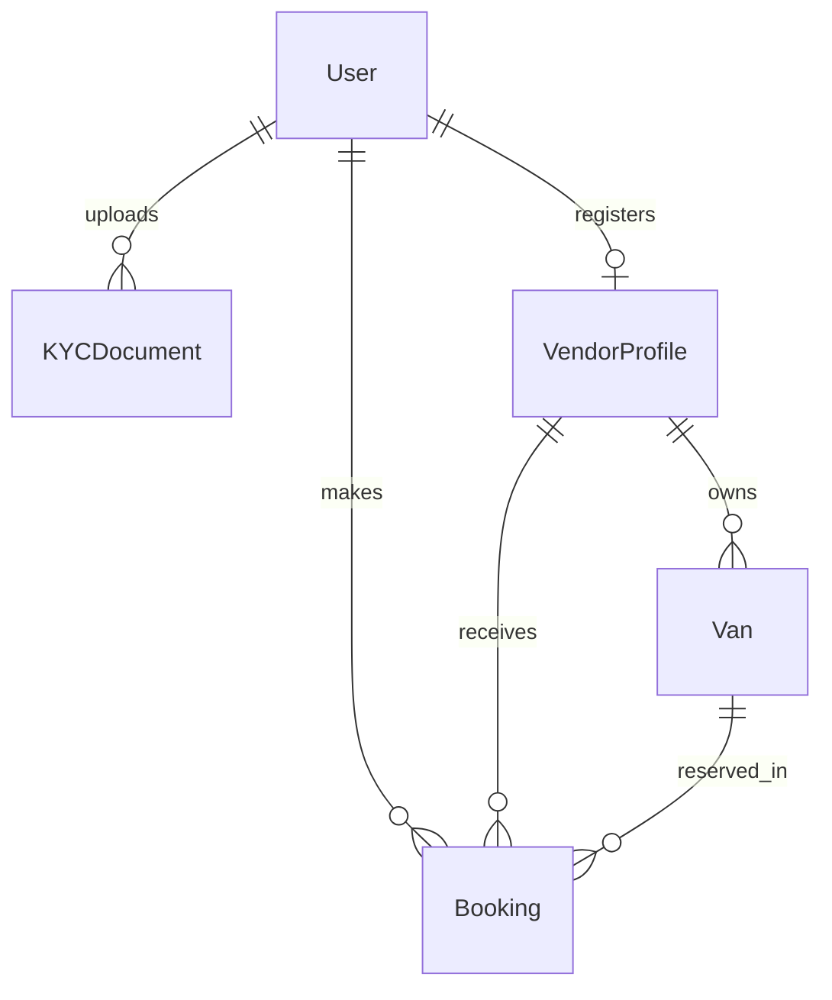

# 9. Database Design (Nivara / ANNA)

This document provides a condensed map of the database schema for the **Nivara** platform (referred to as **ANNA** in the requirements template). It details where core data lives, how it connects, and the permissions governing read/write access.

---

## 1. Core Tables & Descriptions (Step 36)
The database operates on **5 core tables** to manage the listings, bookings, and user lifecycles:
* **`User`**: Stores credentials and account profiles for Customers, Vendors, and Admins.
* **`KYCDocument`**: Stores customer identity verification records.
* **`VendorProfile`**: Stores vendor business registration and status records.
* **`Van` (Listing)**: Stores specifications, location, amenities, and pricing for wellness pods.
* **`Booking`**: Records customer reservations, custom presets, and session statuses.

---

## 2. Key Columns & Relationships (Step 37)
Each table uses identifiers and relationships to connect data:
* **`User`**: `id` (🔑), `email` (unique), `role` (Customer/Vendor/Admin), `kycStatus`.
* **`KYCDocument`**: `id` (🔑), `userId` (🔗 links to `User.id`), `fileUrl`, `status`.
* **`VendorProfile`**: `id` (🔑), `userId` (🔗 links to `User.id`), `businessName`, `verificationStatus`.
* **`Van`**: `id` (🔑), `vendorId` (🔗 links to `VendorProfile.id`), `title`, `latitude`/`longitude`, `price15`/`30`/`45`.
* **`Booking`**: `id` (🔑), `customerId` (🔗 links to `User.id`), `vanId` (🔗 links to `Van.id`), `vendorId` (🔗 links to `VendorProfile.id`), `status`, `bookingCode`.

---

## 3. Entity-Relationship (ER) Diagram (Step 38)
The connections show how the entities link together:

---

## 4. Access Permissions (Step 39)
* **Customers**: Can manage own profile, upload own KYC documents, browse active Vans, and create/view own Bookings. Cannot view other users' records.
* **Vendors**: Can manage own profile/VendorProfile, list/edit own Vans, and view Bookings for their vans. Cannot view other vendors' data or customer ID documents.
* **Admins**: Full override control. Can verify accounts, review KYC, suspend listings, and view immutable audit logs.
* **Public (Guests)**: Read-only access to browse active Vans and slot availability.
