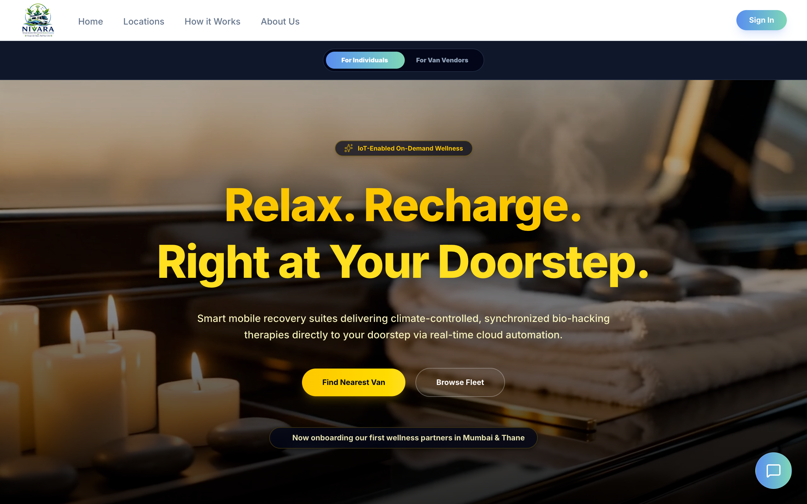
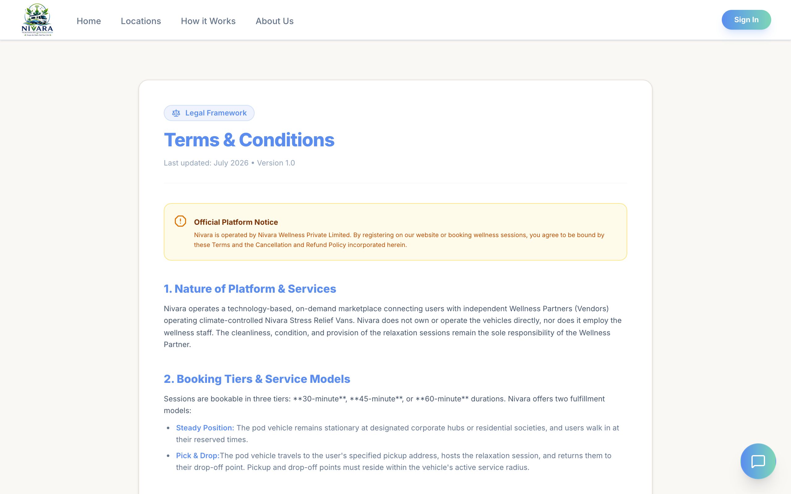
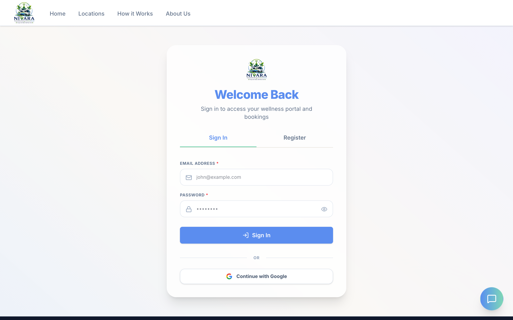
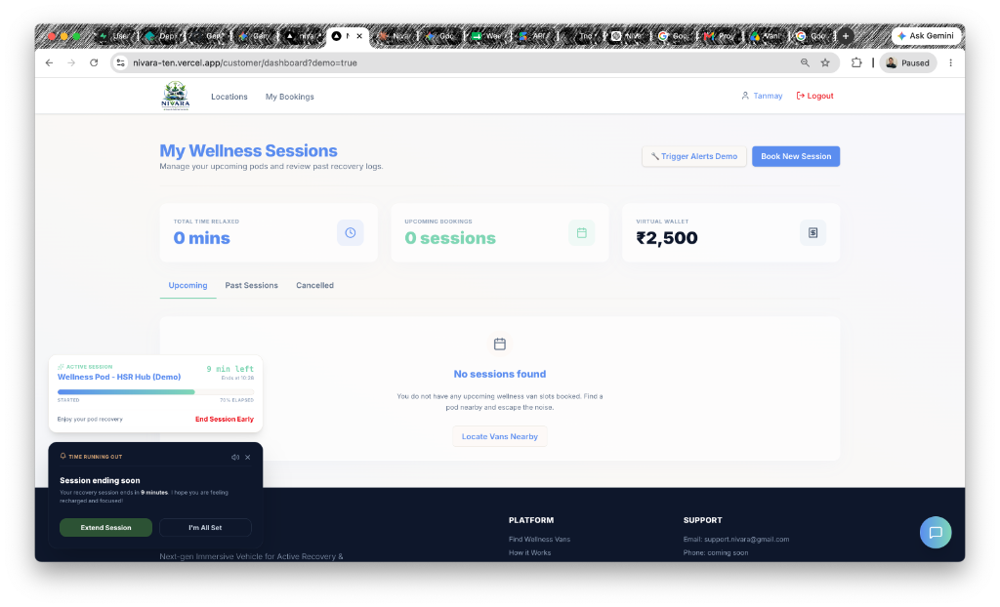

# UI/UX Design System Reference - Nivara

This document serves as the master design system and visual style guide for the **Nivara Mobile Wellness** platform. By centralizing our design tokens, reusable components, and behavioral states, we ensure visual coherence and functional consistency across all customer, vendor, and administrator dashboards.

---

## 🎨 1. Core Brand Colors

Our color palette reflects a premium, serene, and grounding wellness experience.

| Role | Color Name | HEX Code | CSS Variable | Visual Swatch |
| :--- | :--- | :--- | :--- | :--- |
| **Primary** | Premium Navy | `#0A2540` | `--primary` |  |
| **Secondary** | Forest Green | `#2C5234` | `--secondary` |  |
| **Accent** | Warm Amber | `#D4A373` | `--accent` |  |
| **Background** | Premium Cream | `#FAF8F5` | `--background` |  |
| **Border** | Sand Gray | `#E5E1D8` | `--border` |  |

---

## ✍️ 2. Typography

We combine high-contrast classic serifs with clean sans-serif bodies.

* **Headings (`font-serif`)**: *Playfair Display*, serif. Used for page titles, hero headers, and card titles to emphasize a luxurious and tranquil tone.
* **Body Text (`font-sans`)**: *Inter*, sans-serif. Used for secondary text, forms, logs, meta info, and navigation to guarantee clean readability.

---

## 🎛️ 3. Reusable UI Components

### 🖱️ Buttons
All buttons feature standard `rounded-md` (6px) or `rounded-lg` (8px) corners, explicit hover transitions, and a shadow-sm.

| Button Type | normal state CSS | hover state CSS | Spacing & Padding | Usage |
| :--- | :--- | :--- | :--- | :--- |
| **Primary Action** | `bg-[#0A2540] text-white` | `hover:bg-[#0A2540]/95` | `px-4 py-2` or `py-3 px-4` | Prominent calls to action (e.g. *Book New Session*) |
| **Secondary Action** | `bg-[#2C5234] text-white` | `hover:bg-[#2C5234]/95` | `px-4 py-2` | Success actions (e.g. *Confirm Refuel*) |
| **Outline/Ghost** | `bg-white border-[#E5E1D8] text-primary` | `hover:bg-gray-50` | `px-4 py-2` | Secondary actions (e.g. *Cancel selection*, *Trigger Demo*) |
| **Destructive/Danger** | `border-red-200 text-red-600` | `hover:bg-red-50` | `py-2 px-4` | Critical cancellations (e.g. *Cancel Session*) |

#### Visual Example: Landing Page Buttons and Header Actions

---

### 💳 Cards & Panels
Cards are the building block of our layout content containment.

* **Glass Cards**:
  * **Styles**: `bg-white/80 backdrop-blur-md border border-[#E5E1D8] rounded-xl (12px) p-5 shadow-sm transition-all duration-300 hover:scale-[1.01]`.
  * **Usage**: Key metric displays (e.g. *Nivara Balance*, *Upcoming Bookings* cards).
* **Flex List Cards**:
  * **Styles**: `bg-white border border-[#E5E1D8] rounded-xl p-5 hover:shadow-md transition-shadow`.
  * **Usage**: Lists of user bookings and vendor van items.

#### Visual Example: Corporate Policy Page Layout & Informational Panels

---

### 📝 Form Fields & Input Elements
Inputs are designed to have soft, readable fields:

* **Text & Number Inputs**:
  * **Styles**: `bg-[#FAF8F5] border border-[#E5E1D8] rounded-lg (8px) px-4 py-2 text-primary focus:outline-none focus:ring-1 focus:ring-[#2C5234]`.
  * **Usage**: Wallet refuel field, login/register forms, search query inputs.
* **Option Selector Toggles**:
  * **Styles**: Flex cards with `border border-[#E5E1D8] hover:bg-gray-50 rounded-xl p-4 cursor-pointer`. Select state: `border-[#2C5234] bg-[#2C5234]/5 ring-1 ring-[#2C5234]`.
  * **Usage**: Checkout page payment method selectors (Card vs. Wallet Balance).

#### Visual Example: Login Credentials Inputs & Forms

---

## 🔔 4. Interactive Live Warning Popups

### 🚀 Zomato/Swiggy-Style Alert
Designed to capture immediate attention without completely obstructing the screen.

* **Design Specifications**:
  * **Position**: Floating bottom-left on desktop (`fixed bottom-6 left-6 z-50`), full-width sliding up from screen bottom on mobile.
  * **Theme**: Premium dark theme context card (`bg-slate-950 text-slate-100 p-5 rounded-2xl border border-slate-800 shadow-2xl`).
  * **Audio**: programmatically synthesized soft dual-tone meditation chime (A4 + A5 sine waves, 1.8s decay, volume toggle).
  * **Call to Actions**: Secondary Green button (`Extend Session`), outline dark button (`I'm All Set`).
